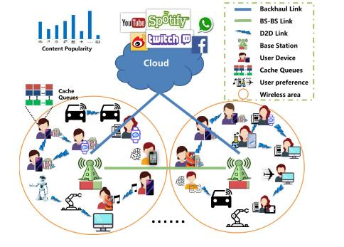
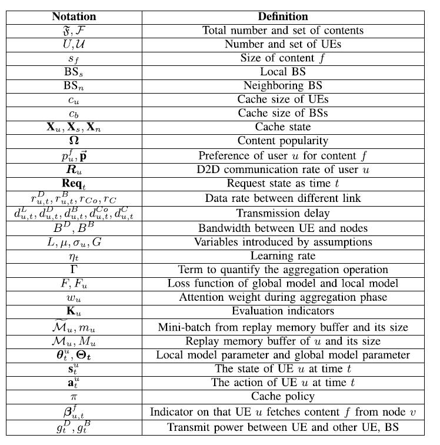
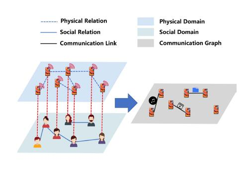
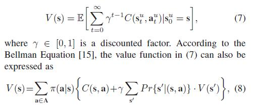
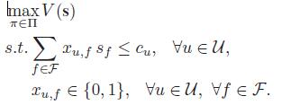

# Attention-Weighted Federated Deep Reinforcement Learning for Device-to-Device Assisted Heterogeneous Collaborative Edge Caching
## 中：用于设备到设备辅助异构协作边缘缓存的注意力加权联邦深度强化学习
#### 作者：Xiaofei Wang , Senior Member, IEEE, Ruibin Li, Graduate Student Member, IEEE, Chenyang Wang, Graduate Student Member, IEEE, Xiuhua Li , Member, IEEE, Tarik Taleb , Senior Member, IEEE, and Victor C. M. Leung , Life Fellow, IEEE
#### 时间：27 10月 2018

## 系统模型
###  网络架构

$\mathcal{F}=\{1,2,..,\mathfrak{F}\}$：流行的信息，id $s_f$是指其信息$f$大小

$\mathcal{U}=\{1,2,...,U\}$：用户设备**UE**的索引，$c_u$是指设备可用存储

$BS_s,BS_n$分别指本地基站和邻居基站（只考虑一个邻居基站）
基站之间通过光纤通信，传输用户请求信息

$c_b$是可用存储

$Cloud Sever$有足够的容量存储$\mathcal{F}$的所有信息，与基站之间是回程链路连接

$x_{u,f},x_{s,f},x_{n,f}=\{0,1\}$ 指的是设备$u$，本地基站$s$,邻居基站$n$有没信息$f$

$X_u,X_s,X_n$分别指设备$u$，本地基站$s$,邻居基站$n$的缓存状态

总结了一些关键的建模参数和符号：

###  信息流行度和用户偏好模型
假设在一个相对较长的时间内，信息的流行度不会改变，计算每条信息的流行度（MZipf distribution 齐夫定律）：
$$\omega_f = \frac{(O_f+\tau)^{-\beta}}{\sum_{i\in \mathcal{F}}(O_i+\tau)^{-\beta}},\forall f \in \mathcal{F}
$$

$O_f$是流行度的倒序排名，$\tau$是高原因数，$\beta$是偏度因子 

$\Omega=(\omega_f)^{1×\mathfrak{F}}$

用户偏好，用户对信息的请求在其总请求的占比表示其概率：
$$p_{u}^f = \frac{R_{u,f}}{R_u},\forall u \in \mathcal{U},\forall f \in \mathcal{F}
$$

$R_{u,f}$表示用户$u$对信息$f$的请求数

$R_u$表示表示在所考虑的时间段内来自用户$u$的内容请求总数

$\forall u \in \mathcal{U},\sum_{f\in \mathcal{F}}p_u^f=1$

### D2D共享模式

物理维度：考虑到信号强度等，只能在用户$u$附近的用户的才可能从$u$获取信息

社会关系维度：社交关系较强的移动用户更愿意直接分享自己的内容。

从物理维度和社会关系维度分析了用户间的距离，即可能进行信息共享的链路。

通信图的边是物理维度与社会关系维度的交集。

通信图的定义：$\mathcal{G}_C:=\{\mathcal{U},\mathcal{E}_C\},\mathcal{E}_C:=\{(u,v):e^c_{uv}=1\} $

注：$e^c_{uv}=1$ 表示用户$u,v$既相邻，又是社会关系强的。

D2D信息共享的概率：利用 tanimoto coefficients计算（度量相似度）

$$r_{uv}^{tan}=\frac{\vec{p_u}\cdot \vec{p_v}}{||\vec{p_u}||^2+||\vec{p_v}||^2-\vec{p_u}\cdot \vec{p_v}},\forall u,v \in \mathcal{U}
$$

$\forall u \in \mathcal{U},\vec{p_u}=(p_u^f)^{1×\mathfrak{F}}$

$r^{tan}_{uu}=0 $对于$ (u,u) $

D2D信息共享的概率 $R_{uv}=r_{uv}^{tan}e^c_{uv}$，$\mathbf{R_u}=(R_{uv})^{1×U}$,其中$R$是归一化后的，$R_{uv}=\frac{R_{uv}}{\sum_vR_{uv}}$

### 信息传输和延迟模型
$\mathcal{T}={1,2,...,T}$：表示时间段

$t ∈ \mathcal{T}$, UE $u$发送请求 $r_{u,t}$获取信息 $f_{u,t}$

$\mathbf{Req}_t = \{r_{1,t} , r_{2,t} , . . . , r_{U,t} \}$ 描述在$t$时请求状态.

对于每个信息的来源会有五种情况，延迟$d$ 会有很大差异，如下图所示，

1. 本地缓存  $d_{u,t}^L=0$

2. D2D $d_{u,t}^D:=\frac{s_{f_{u,t}}}{r_{u,t}^D}$

3. $BS_s$ $d_{u,t}^B:=\frac{s_{f_{u,t}}}{r_{u,t}^B}$

4. $BS_n$ $d_{u,t}^{Co}:=d_{u,t}^B+\frac{s_{f_{u,t}}}{r_{u,t}^{Co}}$

5. 云服务器  $d_{u,t}^{C}:=d_{u,t}^B+\frac{s_{f_{u,t}}}{r_{u,t}^{C}}$

此处的 $r_{u,t}^X$ 表示各信道$X$的传输速率

有以下的关系：
$$d_{u,t}^L<d_{u,t}^D<d_{u,t}^B<d_{u,t}^{Co}<d_{u,t}^C
$$

## 问题表述

UE 中节点选择和缓存替换的联合问题表述为马尔科夫决策过程 (MDP)。

**A. UE State**

$ \mathbf{s}_t^u = [\mathbf{\Omega}_t,\vec{p}_u,r_{u,t}^D,\mathbf{X}_u,\mathbf{I}_f] $

$ \mathbf{I}_f $是节点缓存请求信息$f$的指标.

**B.UE Action**

UE $u$ 通过上述方法决定从哪里获取内容，以及在其缓存列表中替换哪些内容。

$\mathbf{a}_t^u = [\beta^f_{u,v,t},\mathbf{X}^f_{u,t}]$

$\beta^f_{u,v,t}$：从哪个节点获取信息，$\mathbf{X}^f_{u,t}$:是否把信息$f$加到缓存队列

**C. System Reward**

奖励分为**D2D网络共享数据量(最大化)** 和 **信息共享延迟(最小化)** 两个方面.

D2D共享激励函数 D2D Sharing Gain:
$$ C_{u,t}^1 = \sum_{v \in \mathcal{U}}s_{ f_{u,t} }R_{u,v}x_{v,f}(1-x_{u,f}),\forall u \in \mathcal{U},\forall t \in \mathcal{T}
$$

信息获取激励函数 Content Fetch Gain:
$$ \begin{aligned}
C^2_{u,t}=
\left\{
\begin{array}{l}
\psi e^{-d^L_{u,t}},\text{Local Cache}\\
\psi e^{-(d_u^Q+d^D_{u,t})},\text{D2D Communication}\\
\psi e^{-d^B_{u,t}},\text{Communication to }B_s\\
\psi e^{-d^{Co}_{u,t}},\text{BS − BS Cooperation}\\
\psi e^{-d^C_{u,t}},\text{Cloud Service}\\
\end{array}
\right.
\end{aligned}
$$
采用关于延迟的负指数函数来实现最小化内容获取延迟的目标

其中$d_u^Q$是平均排队等待时间

防止$C^1，C^2$的差距过大，$\psi$作为平衡参数，

差距过大会使得较小的一项不起作用

System reward ($\lambda_1,\lambda_2$ 权重因子)

$$ C(\mathbf{s}_t^u,\mathbf{a}_t^u) = \lambda_1C^1_{u,t}+\lambda_2C^2_{u,t},\forall u \in \mathcal{U},t \in \mathcal{T}\\
where\ \lambda_1+\lambda_2 = 1,0\leq \lambda_1,\lambda_2 \leq 1 $$

**D. Value Function**
价值函数（目标是找到一个最优策略来优化预期的长期奖励）

MDP假设，也就是说，**当前Agent所作的策略仅仅与当前状态有关，与以前的状态都没有关系**

将缓存策略 π 定义为从当前状态到一系列动作的映射，例如，$π(a|s^u_t )$ 是在策略 π 下状态被 $s^u_t$时采取动作 a 的可能性，并且 $a^u_t$ = $max_{a∈A}π (a|s^u_t)$。 

期望每个 UE 学习最佳缓存策略 $π^∗ ∈ \mathcal{Π}$。 

在联合节点选择和缓存替换方面的 D2D 辅助异构边缘缓存问题可以被公式化以最大化价值函数为(长期混合整数线性规划（LT-MILP）)

